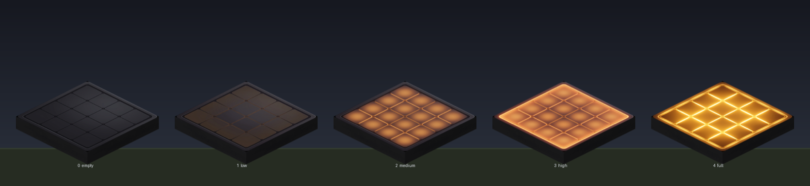
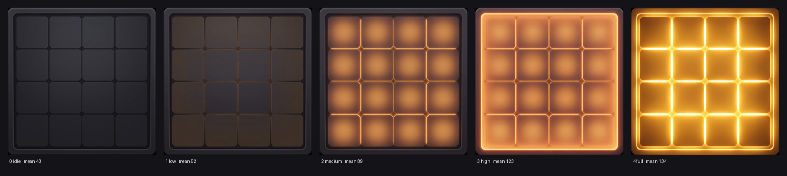

# Small Solar Panel — Design Direction

The visual and behavioural reference for `atlas:small_solar_panel`. Anything that changes the
block's model, textures or charge states should match what is written here.

## Art direction

Derived from [`references/power-system-reactive-states.jpg`](references/power-system-reactive-states.jpg),
which sets the language for the whole power system. The Small Solar Panel follows the panel drawn
there, in its Idle and Charging/Full states.

- **Silhouette** — a thin flat slab lying on the ground. Not a tilted panel, not a frame on legs.
- **Body** — near-black charcoal, soft matte, low contrast.
- **Bezel** — a thin raised darker rim around all four edges with gently rounded corners.
- **Face** — a 4x4 grid of large rectangular cells with chamfered corners, divided by thin seams.
- **Energy colour** — amber/orange only. The seams light first, then the cells fill, ending in a
  bright glow that washes across the bezel. No cyan, no gold trim, no cool tones.
- **Framing (textures)** — flat head-on orthographic, no perspective, no drop shadow, edge to edge
  with zero margin. The reference is drawn isometric; textures must not be.

Shipped textures are **512x512**. The 1024 masters live in [`textures/`](textures/).

### Rejected directions

Kept so they are not revisited. In order:

1. **Photorealistic monocrystalline panel** — real chamfered cells, white backsheet, brushed
   aluminium frame. Rejected: *"too realistic doesn't fit the minecraft/industrial factory vibe."*
2. **Dark hex-armor sci-fi** — chosen from a set of four stylised mockups, then rejected:
   *"I hate all the options proposed i want more realistic."*
3. **Realistic but game-ready** — real panel anatomy with heightened contrast and crisp edges.
   Superseded when the reference chart above was supplied.
4. **Gold-and-cyan hex circuit** — built from
   [`references/earlier-hex-circuit-block.jpg`](references/earlier-hex-circuit-block.jpg). Good in
   isolation, but its chunky gold corner brackets suit a solid cube, not a flat panel, and the
   palette diverged from the rest of the power system.

## Model

`assets/minecraft/models/block/custom/small_solar_panel_base.json` — a single element.

| | |
|---|---|
| Bounds | `[1, 0, 1] → [15, 2, 15]` |
| Footprint | 14x14, inset 1px on every side |
| Height | 2px of 16 |
| Faces | `up` = `#top`, `down` = `#bottom` (cullface down), four sides = a 2px band of `#side` |

The slab is deliberately one element. An earlier seven-element tilt frame (ground rails, crossbeam,
front/rear legs, junction box, tilted panel) was replaced because in-world it read as scattered
debris under the panel and its rails projected past the block footprint.

Because the block is **not a full cube**, all variants set `can-occlude: false`,
`is-view-blocking: false` and `propagate-skylight: true`. Without these the client treats it as a
solid cube, culls the neighbouring blocks' faces against it, and you can see through the world.

## Charge states

Five visual states, one per unit of charge (`maxStorage` is 4), mirroring `SmallBattery`.

| Power | Block ID | Face |
|---|---|---|
| 0 | `atlas:small_solar_panel` | dark, inert |
| 1 | `atlas:small_solar_panel_low` | seams faintly amber |
| 2 | `atlas:small_solar_panel_medium` | cells filled, soft amber |
| 3 | `atlas:small_solar_panel_high` | strong orange-amber, glow reaching the bezel |
| 4 | `atlas:small_solar_panel_full` | full blaze, bezel flooded |

### The ramp must be verified numerically

Generating N glow levels from prompts produces a **non-monotonic ramp nearly every time**. Observed
failures, all caught by measurement and none obvious by eye:

- a `full` measurably *darker* than `high` (saturated orange reads bright but has lower luminance)
- a `medium` brighter than `high`
- a `low` *darker than idle*, because the edit dimmed the whole face instead of only adding the ember
- a `high` within 0.2 of `medium` — indistinguishable in game

After regenerating any state, measure the mean brightness of each texture and confirm it strictly
increases. Word state edits as **purely additive** — "do not darken anything, only add …" — which is
what fixes the dimming failure.

Current measured ramp: **43 → 53 → 89 → 123 → 134**.

## Behaviour

- Generates 2 power per 10s while `world.time` is in `0..12000`, capped at `maxStorage = 4`.
- **Dedicated output through the base.** `canOutputToward` accepts only `BlockFace.DOWN`; every
  other face is sealed, and the panel actively pushes stored power into the block below rather than
  waiting to be drained. The bottom texture carries the cable socket accordingly.
- No particle effects. An earlier ambient effect was removed at request.

## Asset pipeline

Textures are generated with the **Artlist MCP using Nano Banana Pro** (`modelGroupId` 117 —
text-to-image `2071`, image-to-image `2004`) at `aspect_ratio: "1:1"`, `quality: "2K"`, then
downscaled to 512 with `sips -z 512 512`.

Upload a reference image and pass it as an Artlist reference rather than describing it in words —
style transfer is far more faithful. Derive every state and sibling face image-to-image from the
first generation so the set stays consistent.

The in-game renders here are produced by rasterising the real model JSON against the installed
textures — parsing elements, UV rects and rotations, applying Minecraft's face shading
(top 100%, north/south 80%, east/west 60%, bottom 50%) and depth sorting. That is how the tilt
frame's problems were caught before anything shipped.

### Careful with the side texture

The model UV-slices `#side` — the slab samples only the `[1,14]–[15,16]` band. Any side texture
needs even, low-contrast, horizontally-banded detail with no centred focal feature, or it will be
sliced through the middle of something.
